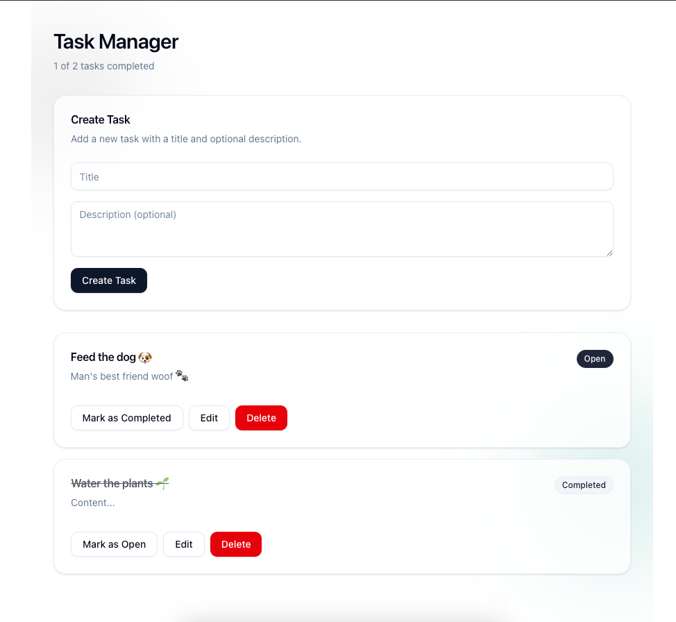

# Frontend (React + Vite + shadcn/ui)

## Prerequisites

- Node.js 18+
- pnpm 10+

## Setup

From project root:

```bash
cd frontend
pnpm install
pnpm dev
```

Frontend dev server:
- `http://127.0.0.1:5173`

## Environment Variable

Optional `.env` in `frontend/`:

```env
VITE_API_BASE_URL=http://127.0.0.1:8000
```

Default API base URL is `http://127.0.0.1:8000` if not set.

## Available Scripts

Run from `frontend/`:

```bash
pnpm dev
pnpm build
pnpm lint
pnpm preview
```

## Root Script Note

If backend and frontend are already set up, you can run from project root:

```bash
pnpm run dev:frontend
pnpm run build:frontend
```
## Preview


